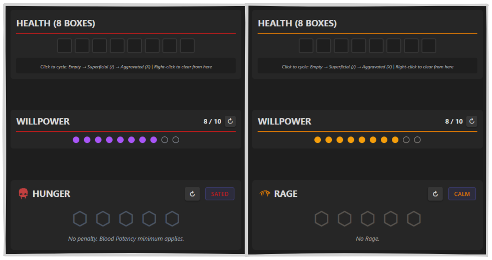
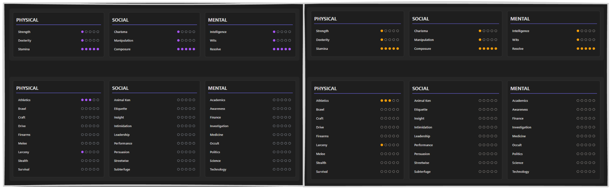
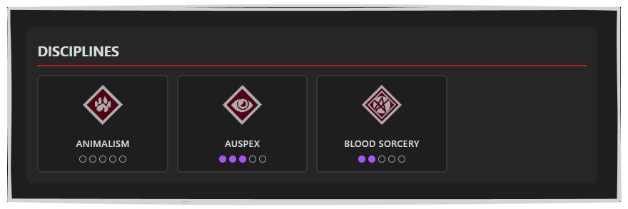
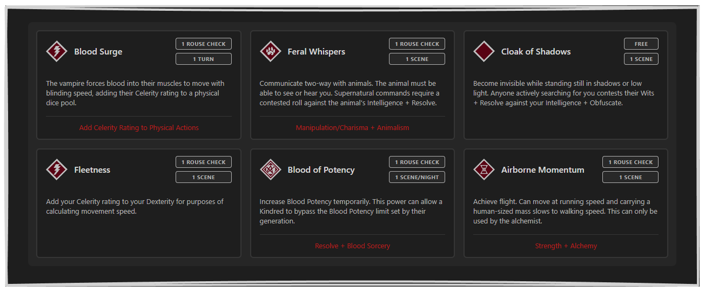
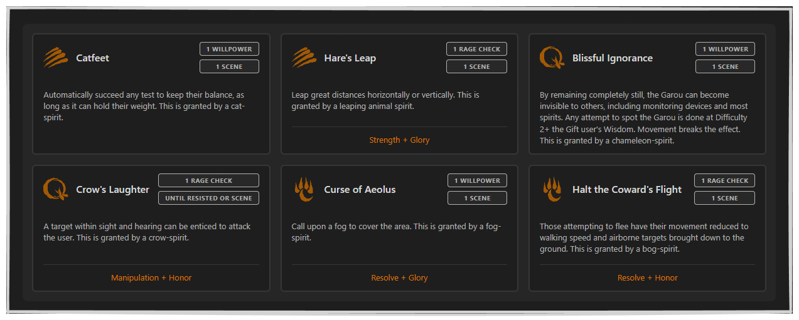

# World of Darkness UI Toolkit

<p align="center">

</p>

> _Portions of the materials are the copyrights and trademarks of Paradox Interactive AB, and are used with permission. All rights reserved. For more information please visit **[worldofdarkness.com](https://worldofdarkness.com)**._

This is **an unofficial, fan-made plugin** for managing World of Darkness character sheets directly inside your Obsidian vault, created and shared under the [**Dark Pack Agreement**](https://www.paradoxinteractive.com/games/world-of-darkness/community/dark-pack-agreement).
It is a **non-commercial project** and is **not affiliated with, endorsed, or sponsored by Paradox Interactive AB**.

---

The toolkit allows storytellers and players to manage complete character sheets directly within Obsidian. It provides interactive, state-aware components for tracking vital statistics such as Health, Willpower, Hunger, and Rage, along with structured views for Attributes, Skills, and Powers.

Unlike static text templates, this plugin offers a functional interface that responds to user input and automatically adapts its visual style to reflect the identity and mechanics of each supported game line.

### Supported Games

Currently supported:

- **Vampire: The Masquerade 5th edition**
- **Werewolf: The Apocalypse 5th edition**

<br>

> _Support for additional World of Darkness games may be added in the future._

## Installation

### Manual Installation

1. Download the latest release from the [**Releases**](#) page.
2. Extract the files into your vault's plugin folder:

```
<VaultFolder>/.obsidian/plugins/wod-ui-toolkit/
```

3. Reload Obsidian.
4. Enable **WoD UI Toolkit** under **Settings > Community Plugins**.

## Configuration

Open:<br>
**`Settings > WoD UI Toolkit`**.

- **Active Game System:**<br>
  Controls how generic (`wod-*`) blocks behave and render between:
    - _Vampire: The Masquerade (V5)_
    - _Werewolf: The Apocalypse (W5)_

<br>

> **Note:** You must reload Obsidian after changing the game system for changes to take effect <br> (Cmd/Ctrl+P > Reload app without saving).

## Usage Guide

The plugin uses **custom code blocks** to render character sheet elements.
You can choose between **context-aware generic blocks** or **game-specific blocks**, depending on how much control you want.

### Block Types Overview

#### 1. Generic Blocks (`wod-*`)

These blocks automatically adapt their **appearance and mechanics** based on your current plugin settings.

Use these if you want your character sheet to **update automatically** when switching game systems.

**Available Generic Blocks**
| Block | Description |
| ----- | ----------- |
| `wod-resource` | Hunger (VTM) or Rage (WTA) |
| `wod-morality` | Humanity (VTM) or Harmony (WTA) |
| `wod-advantage` | Blood Potency (VTM) or Renown (WTA) |
| `wod-powers` | Section header for Disciplines or Gifts |
| `wod-power-list` | Individual power cards |
| `wod-attributes` | Physical / Social / Mental grid |
| `wod-skills` | Complete skills list |
| `wod-health` | Health tracker (Superficial / Aggravated) |
| `wod-willpower` | Willpower tracker |
| `wod-exp` | Experience tracker |
| `wod-merits` | Merits & Flaws list |

#### 2. Game-Specific Blocks (`vtm-*`, `wta-*`)

These blocks **force a specific game system**, regardless of your plugin settings.

Use these when you want **explicit control** over mechanics or presentation.

#### Vampire: The Masquerade (V5)

| Block | Description |
| ----- | ----------- |
| `vtm-hunger`| Hunger Dice tracker |
| `vtm-humanity` | Humanity tracker with Stains |
| `vtm-blood-potency` | Blood Potency tracker |
| `vtm-disciplines` | Disciplines section header |
| `vtm-power-list` | Discipline powers list |
| `vtm-attributes` |
| `vtm-skills` |
| `vtm-health` |
| `vtm-willpower` |
| `vtm-exp` |
| `vtm-merits` |

#### Werewolf: The Apocalypse (W5)

| Block | Description |
| ----- | ----------- |
| `wta-rage` | Rage Dice tracker |
| `wta-harmony` | Harmony tracker |
| `wta-renown` | Renown tracker (Glory, Honor, Wisdom) |
| `wta-gifts` | Gifts section header |
| `wta-gift-list` | Gifts / Rites list |
| `wta-attributes` |
| `wta-skills` |
| `wta-health` |
| `wta-willpower` |
| `wta-exp` |
| `wta-merits` |

## Example Usage

### Vital Statistics

Track health, willpower, and your primary supernatural resource using standard trackers.

````
```wod-health
```

```wod-willpower
```

```wod-resource
```
````

<p align="center">

</p>

### Attributes and Skills

These blocks automatically populate based on the active game system.

````
```wod-attributes
```

```wod-skills
```
````

<p align="center">

</p>

### Disciplines

Use the `wod-powers` or `vtm-disciplines` block to define **Discipline sections** for _Vampire: The Masquerade_.

````
```wod-powers
Animalism
Auspex
Blood Sorcery
```
````

<p align="center">

</p>

> _Currently supported for Vampire: The Masquerade only._

### Powers and Abilities

Use `wod-power-list`, `vtm-power-list`, or `wta-gift-list` to list individual **Discipline powers** or **Gifts**.

When used in a Vampire context, entries are treated as **Discipline powers**, and icons are automatically resolved based on the specified Discipline.

````
```vtm-power-list
- name: Soaring Leap
  discipline: Potence
  tags: [Cost: Free, Duration: Passive]
  pool:
  description: Leap higher and further than usual.
```
````

<p align="center">

</p>

When used in a Werewolf context, entries are rendered using **W5 mechanics and styling**.
Icons are resolved automatically, but can be overridden using the `icon` field.

````
```wta-gift-list
- name: Halt the Coward's Flight
  icon: Black Furies
  tags: [Cost: 1 Rage Check, Duration: 1 Scene]
  pool: Resolve + Honor
  description: Those attempting to flee have their movement reduced to walking speed and airborne targets brought down to the ground. This is granted by a bog-spirit.
```
````

<p align="center">

</p>

### Power & Gift Lists Syntax

The `*-power-list` and `*-gift-list` blocks accept a YAML list.

| Property | Description | Example |
| :------- | :---------- | :------ |
| `name` | **Required.** The name of the power/gift. | `name: Soaring Leap` |
| `discipline` | (VTM Only) Determines the icon used. | `discipline: Potence` |
| `icon` | (WTA/Override) Specific icon name (Tribe/Auspice). | `icon: Black Furies` |
| `cost` | Resource cost. | `cost: 1 Rage Check` |
| `pool` | Dice pool to roll. | `pool: Strength + Athletics` |
| `tags` | List of quick reference tags. | `tags: [Passive, Amalgam]` |
| `description` | Full text description. | `description: Leap high...` |
